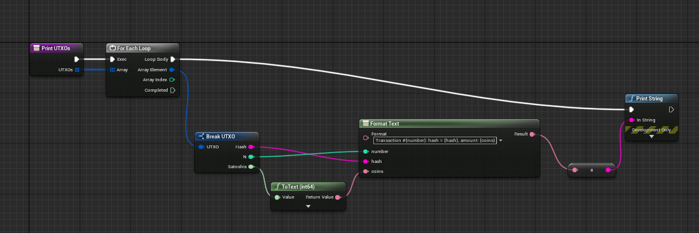
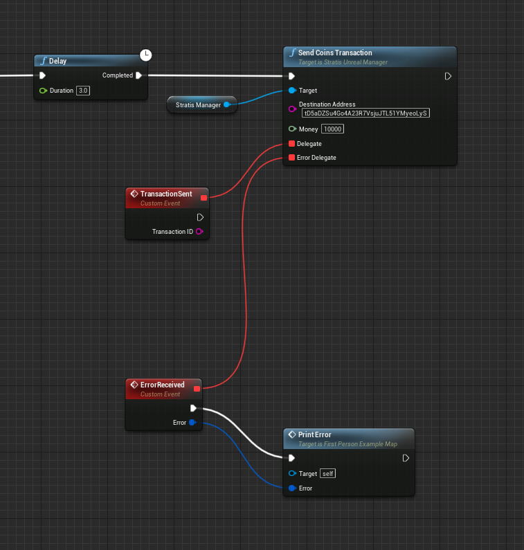

#########################
Unreal Engine Integration
#########################

This tutorial will take you through the steps of setting up an environment and performing basic
interaction with the STRAX Mainnet Blockchain.

**************
Pre-Requisites
**************

-  Download and install `.NET Core SDK 3.1 <https://dotnet.microsoft.com/download/dotnet/3.1>`_

-  Download and install `Git <https://git-scm.com/downloads>`_

-  Download `Stratis Unreal Engine Plugin <https://github.com/stratisproject/UnrealEnginePlugin>`_

*The Stratis Unreal Engine Plugin is currently going through the Unreal Marketplace approval process, in the meantime, the package can be obtained from our GitHub source above.*

*************************
Prepare Stratis Full Node
*************************

First, you must obtain a local copy of the Stratis Full Node; this can
be achieved by using the git clone command. 

For the purpose of this document, we will be using the desktop as the
root directory. 

**Execute the below command**: 

.. code-block:: bash

   git clone http://github.com/stratisproject/StratisFullNode C:/Users/Admin/Desktop/StratisFullNode

The above command will clone the source code to the below directory,

.. code-block:: bash

   C:\Users\Admin\Desktop\StratisFullNode\src\Stratis.StraxD

It's cloned now so let's go to the source and let's build it.

.. code-block:: bash

   dotnet build

Once the build has completed, we can run the project.

.. code-block:: bash

   dotnet run -txindex=1 -addressindex=1 -unityapi_enable=true -unityapi_apiuri=http://0.0.0.0

Once we execute the command, a local version of Stratis FullNode will
start running and syncing with the mainnet. While it's syncing we can open the port in the firewall, as we want to
allow inbound ports.

The default port for Unity/Unreal API is
44336, but you can specify what you want by altering the ``-unityapi_apiuri=http://0.0.0.0`` parameter, for example ``-unityapi_apiuri=http://0.0.0.0:12345`` would configure the Unity/Unreal API to listen on ``TCP12345``.

Now let's check if it works, so first let's go to swagger on
http://localhost:44336.

**Note**: The node can take some time depending on the internet speed, and available resources
to get fully synced. The synchronization completion can be confirmed by the viewing the console and checking the below

.. code-block:: bash
   
   >> Consensus Manager
	Tip Age                 : 00.00:00:07 (maximum is 00.00:12:48)
	Synced with Network     : Yes

Once the node is fully synchronized; let's go and run Unreal Engine and try to connect to our API.

*************
Running Unreal Engine
*************

Create a new project within Unreal Engine and install the Stratis Unreal Engine Plugin (that we obtained earlier) to the ``Plugins`` directory within project's root path.
Once it's imported we are ready to go. 

Now we need to generate a new mnemonic. You can create mnemonic `using just a pen, a paper, and a dice <https://armantheparman.com/dicev1/>`_\ , or using different hardware or software mnemonic generators.
You can also just use your old mnemonic in case you already have a wallet created in Unreal Engine (or Unity). 

Then, we need get an address of our wallet.

.. raw:: html

   

   
<a>C++ version</a>

|

First of all, we need to set up ``StratisUnrealManager`` to be able to use all of the API methods provided by the plugin.

Let's open the **Source** path of your project and create a new header named ``StratisHandler.h``\ :

.. code-block:: cpp

   #pragma once

   #include "CoreMinimal.h"
   #include "UStratisUnrealManager.h"

   #include "StratisHandler.generated.h"

   UCLASS(minimalapi)
   class UStratisHandler : public UObject {
     GENERATED_BODY()

   public:
     UStratisHandler();

     UPROPERTY()
     UStratisUnrealManager *stratisManager;

     UWorld *GetWorld() const override;
   };

Then, we need to initialize ``stratisManager`` variable and implement function that prints address.

.. code-block:: cpp

   UStratisHandler::UStratisHandler() {
     stratisManager =
         CreateDefaultSubobject<UStratisUnrealManager>(TEXT("StratisManager"));

     stratisManager->setBaseUrl(TEXT("http://148.251.15.126:44336"));
     stratisManager->setPredefinedNetwork(ENetwork::CIRRUS_TEST);
     stratisManager->setMnemonic(TEXT("legal door leopard "
                                      "fire attract stove "
                                      "similar response photo "
                                      "prize seminar frown"));
   }

   void printAddress() {
      UE_LOG(LogTemp, Display, TEXT("Address: %s"), *(stratisManager->getAddress()));
   }

.. raw:: html

   

.. raw:: html

   

   
<a>Blueprint version</a>

|

.. image:: images/initialize-manager.png
   :target: images/initialize-manager.png
   :alt: Object construction

|

.. image:: images/get-address.png
   :target: images/get-address.png
   :alt: Address printer

|

Now we can find our address in the console log.

.. raw:: html

   

|

Let's copy the address and now let's go back to our Swagger API server. I
has a default wallet that I have prepared here which has ``0.1 STRAX``.

So let's send some STRAX from this wallet. We will go to ``StratisFullNode API`` and build a transaction via the
``/api/wallet/build-transaction`` endpoint.

An example body can be seen below:

.. code-block:: json

   {
  "password": "Sup3rS3cur3!!",
  "walletName": "MyWallet",
  "accountName": "account 0",
  "recipients": [
    {
      "destinationAddress": "<address>",
      "amount": "0.1"
    }
  ],
  "feeType": "low",
  "allowUnconfirmed": true,
  "shuffleOutputs": true
   }

Once executed, a hex will be returned. This hex is an encoded representation of the transaction request just made.
The ``/api/wallet/send-transaction`` endpoint can now be utilized to broadcast the transaction to the network.
You can also just use a Wallet GUI to deposit to your Unreal/Unity Address. The GUI Wallet can be downloaded below:

https://github.com/stratisproject/StraxUI/releases

Now if we go back to Unreal and refresh our balance we can see that the balance has changed.

***********************
Performing Transactions
***********************

We can send two types of transactions, one is a normal transaction where
you supply the destination address and the amount you want to send, and
the second is an op return transaction which basically allows you to
encode any data and post it to the blockchain. So let's try both of
those. Let's say I deposited ``0.0505`` to an address.

Now we can see the transaction was created and we get the transaction
id, based on which we can explore about the transaction on
`Stratis Block Explorer <https://chainz.cryptoid.info/strax/>`_.
Let's open this address in the blockchain explorer and see if any transaction was
created, so it will take some time for the transaction to be mined
before it will appear. Typically it will be less than half a minute, so
let's wait.

Once the transaction is confirmed, it will appear on the explorer, you can select the transaction to see the
transaction detail. i.e. What inputs were selected and what the outputs were.
Now you can do the second type of transaction, which is encoding any
operator and data. So let's put any data in the ``SEND OP_RETURN transaction`` field and click send.

Then again open `Stratis Block Explorer <https://chainz.cryptoid.info/strax/>`_ and look for this address, once the
transaction is confirmed and we can see the transaction details, if we
open it that we have an output ``OP_RETURN`` and it will have your data encoded
there.

****************************************
Performing Transactions using the Plugin
****************************************

Getting a wallet balance
------------------------

.. raw:: html

   

   
<a>C++ version</a>

|

.. code-block:: cpp

   stratisManager->getBalance( {
      if (result::isSuccessful(result)) {
         UE_LOG(LogTemp, Display, TEXT("Balance in satoshis: %llu"),
                  result::getValue(result));
      } else {
         UE_LOG(LogTemp, Error, TEXT("%s"), *(result::getError(result).message));
      }
   });

This code will print your balance if the call succeeds, and print an error otherwise.

.. raw:: html

   

.. raw:: html

   

   
<a>Blueprint version</a>

|

At first, let's make a function for printing balance response to screen. Implement a blueprint like below:

.. image:: images/print-balance-scheme.png
   :target: images/print-balance-scheme.png
   :alt: Print balance

..

   Note: ``Value`` has a type of ``FUInt64``.

Now, let's make a very similar function for the ``Error`` type:

.. image:: images/print-error-scheme.png
   :target: images/print-error-scheme.png
   :alt: Print error

|

Well, now we can call the ``GetBalance`` function and await the result. Add ``GetBalance`` to the event graph (right after manager initialization or after delay like in the example) and set its ``Delegate`` and ``Error Delegate`` fields to custom events via **Get Custom Event**. 

.. image:: images/bind-delegate.png
   :target: images/bind-delegate.png
   :alt: Bind delegate

|

Bind newly-created events to the functions we defined: ``Print Balance`` and ``Print Error``.

Desired event graph is shown below (\ ``Delay`` node is not necessary):

.. image:: images/get-balance-scheme.png
   :target: images/get-balance-scheme.png
   :alt: Get balance final scheme

.. raw:: html

   

|

Getting unspent transaction outputs (UTXOs)
-------------------------------------------

.. raw:: html

   

   
<a>C++ version</a>

|

.. code-block:: cpp

   stratisManager->getCoins( {
       if (result::isSuccessful(result)) {
           const auto &utxos = result::getValue(result);

           for (const auto &utxo : utxos) {
               UE_LOG(LogTemp, Display, TEXT("UTXO #%i, hash: %s, satoshis: %llu"),
                       utxo.n, *(utxo.hash), utxo.satoshis);
           }

       } else {
           UE_LOG(LogTemp, Error, TEXT("%s"), *(result::getError(result).message));
       }
   });

This code will print all of your utxos to log console one-by-one if the call is successful, and print error otherwise.

.. raw:: html

   

.. raw:: html

   

   
<a>Blueprint version</a>

|

At first, let's create a method ``Print UTXOs`` and add the input parameter ``UTXOs`` with type ``Array`` of ``UTXO``. Now we're going to iterate over UTXO's array using **For Each Loop** node:

.. image:: images/iterate-utxos.png
   :target: images/iterate-utxos.png
   :alt: Iterate over UTXOs

|

Now let's just print every UTXO using **Break...** and **Format Text** nodes:

|

We are almost done. Now we just need to call the **Get Coins** node as we did for ``Get Balance`` node, and use functions (\ ``Print UTXOs`` and ``Print Error``\ ) we made previously. The final scheme is shown below:

.. raw:: html

   

|

Sending coins & waiting for a receipt
-------------------------------------

.. raw:: html

   

   
<a>C++ version</a>

|

At first, define a couple of variables:

* ``destinationAddress``\ : in this example, we're using ``tD5aDZSu4Go4A23R7VsjuJTL51YMyeoLyS`` for **Cirrus Test network**
* ``amount``\ : the number of satoshis we want to send. Let's send 10.000 satoshis (= 0.0001 STRAX).

.. code-block:: cpp

   FString destinationAddress(TEXT("tD5aDZSu4Go4A23R7VsjuJTL51YMyeoLyS"));
   int64 amount = 10000;

Now, send ``amount`` of coins to ``destinationAddress`` with the code shown below:

.. code-block:: cpp

   stratisManager->sendCoinsTransaction(
         destinationAddress, amount, [this](const auto &result) {
           if (result::isSuccessful(result)) {
             const auto &transactionID = result::getValue(result);

             // TODO: now we need to await receipt

           } else {
             UE_LOG(LogTemp, Error, TEXT("%s"),
                    *(result::getError(result).message));
           }
         });

Well, now we want to know when the receipt for this transaction is available.
To achieve this, use the code shown below:

.. code-block:: cpp

   this->stratisManager->waitTillReceiptAvailable(
       transactionID, [transactionID](const auto &result) {
         if (result::isSuccessful(result)) {
            UE_LOG(LogTemp, Display,
                     TEXT("Coins had been sent successfuly, transaction "
                        "id: %s"),
                     *transactionID);
         } else {
            UE_LOG(LogTemp, Error, TEXT("%s"),
                     *(result::getError(result).message));
         }
       });

.. raw:: html

   

.. raw:: html

   

   
<a>Blueprint version</a>

|

At first, add the ``Send Coins Transaction`` node and set its inputs:

* ``Destination address``\ : in this example, we're using ``tD5aDZSu4Go4A23R7VsjuJTL51YMyeoLyS`` for **Cirrus Test network**
* ``Money``\ : the number of satoshis we want to send. Let's send 10.000 satoshis (= 0.0001 STRAX).

|

And now we need to join the ``Transaction ID`` output of the ``TransactionSent`` event to the ``Transaction ID`` input of the ``Wait Till Receipt Available`` node.

At last, add some printing logic to see when receipt is available, and we're done.

.. image:: images/await-receipt-scheme.png
   :target: images/await-receipt-scheme.png
   :alt: Await receipt

(See this scheme on `blueprintue.com <https://blueprintue.com/blueprint/zxawrzdx/>`_\ )

.. raw:: html

   

|

So that's pretty much it! Click next to view a further guide based on integrating Stratis Smart Contracts.