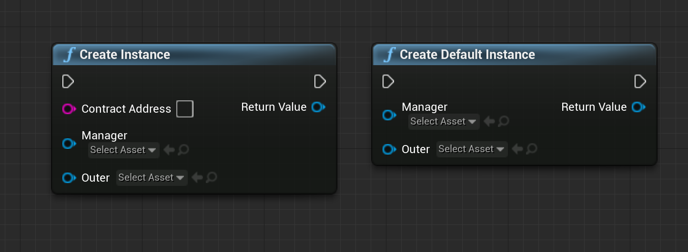
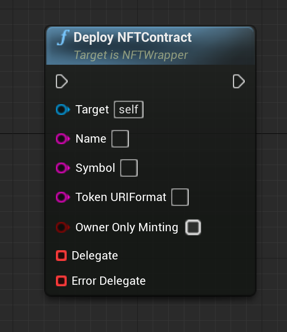

NFT with Stratis Plugin for Unreal Engine
=========================================

In this tutorial we will explain how to start using NFTs with
the Stratis Plugin for Unreal Engine.

The employment of Blockchain technology within the gaming industry has become more ever more apparent with the launch of several popular play-to-earn models. The Stratis Plugin for Unreal Engine enables game developers to design, build and deploy games using existing programming languages within a familiar environment.

Non-Fungible Tokens are an area of particular interest for those developing games with in-game valuables. By introducing an NFT, the player can genuinely own in-game items, removing the risk of losing earned items through forgotten login details and account deactivations. This brings the birth of a radical change in gaming marketplaces, with decentralized platforms offering the exchange of in-game items without the need for a trusted intermediary.

What is required to work with Stratis Smart Contracts and NFTs?
~~~~~~~~~~~~~~~~~~~~~~~~~~~~~~~~~~~~~~~~~~~~~~~~~~~~~~~~~~~~~~~

The `Stratis Plugin Integration <https://academy.stratisplatform.com/Developer%20Resources/UnrealEngine/Integration/UnrealIntegration.html>`_ guide can be followed to setup your local environment for development.

Deploying a new NFT
-------------------
   
At first, we need to generate a new address and fund it. You will need tokens in order to deploy and interact with an NFT.

.. raw:: html

   

   
<a>C++ version</a>

.. code-block:: cpp

   UStratisUnrealManager *stratisManager =
      CreateDefaultSubobject<UStratisUnrealManager>(TEXT("StratisManager"));

   stratisManager->setBaseUrl(TEXT("http://localhost:44336/"));

   stratisManager->setPredefinedNetwork(ENetwork::CIRRUS_TEST);
   stratisManager->setMnemonic(TEXT("legal door leopard "
                                    "fire attract stove "
                                    "similar response photo "
                                    "prize seminar frown"));

   UNFTWrapper *wrapper(UNFTWrapper::createDefaultInstance(manager, this));

   UE_LOG(LogTemp, Display, TEXT("Address: %s"), *(stratisManager->getAddress()));

.. raw:: html

   

.. raw:: html

   

   
<a>Blueprint version</a>

.. image:: images/init-wallet.png
   :target: images/init-wallet.png
   :alt: Initialize wallet

|

.. raw:: html

   

To create instance of UNFTWrapper, we can use ``createInstance`` or ``createDefaultInstance`` methods:

.. raw:: html

   

   
<a>C++ version</a>

.. code-block:: cpp

   UFUNCTION(BlueprintCallable, Category = "NFTWrapper")
   static UNFTWrapper* createInstance(const FString& contractAddress, UStratisUnrealManager* manager, UObject* outer);

   UFUNCTION(BlueprintCallable, Category = "NFTWrapper")
   static UNFTWrapper* createDefaultInstance(UStratisUnrealManager* manager, UObject* outer);

where:

* ``contractAddress`` - address of deployed contract. For ``createDefaultInstance`` method, canonical NFT contract address will be used.
* ``manager`` - valid pointer to ``UStratisUnrealManager`` instance.
* ``outer`` - "parent" object for our new instance.

.. raw:: html

   

.. raw:: html

   

   
<a>Blueprint version</a>

where:

* ``contractAddress`` - address of deployed contract. For ``createDefaultInstance`` method, canonical NFT contract address will be used.
* ``manager`` - valid pointer to ``UStratisUnrealManager`` instance.
* ``outer`` - "parent" object for our new instance.

.. raw:: html

   

To deploy the NFT contract, we need to use the ``deployNFTContract`` method:

.. raw:: html

   

   
<a>C++ version</a>

.. code-block:: cpp

   void UNFTWrapper::deployNFTContract(
       const FString& name, 
       const FString& symbol, 
       const FString& tokenURIFormat,
       bool ownerOnlyMinting, 
       TFunction<void(const TResult<FString>&)> callback)

where:

* ``name``\ , ``symbol``\ , ``tokenURIFormat``\ , ``ownerOnlyMinting`` - parameters passed to `constructor of the NFT contract <https://github.com/stratisproject/CirrusSmartContracts/blob/400e5399e85abf5e0fdb156f07109db5476648b2/Testnet/NonFungibleToken/NonFungibleToken/NonFungibleToken.cs#L159>`_
* ``callback`` - error-aware callback, return either transactionID of contract deployment transaction or error.

.. raw:: html

   

.. raw:: html

   

   
<a>Blueprint version</a>

.. raw:: html

   

Once the transaction is mined it’s executed and your contract is deployed.
After that you can use transaction id to get a receipt which will contain new
contract’s address. For example:

.. raw:: html

   

   
<a>C++ version</a>

.. code-block:: cpp

   wrapper->deployNFTContract(
      /* name */ TEXT("GameSwords"),
      /* symbol */ TEXT("SW"),
      /* tokenURIFormat */ TEXT("GameSwords_{0}"),
      /* ownerOnlyMinting */ false,
      /* callback */  {
         if (result::isSuccessful(result)) {

         FString transactionID(result::getValue(result));

         this->stratisManager->waitTillReceiptAvailable(
               transactionID, [transactionID](const auto &result) {
               if (result::isSuccessful(result)) {

                  FString contractAddress(
                     result::getValue(result).newContractAddress);

                  UE_LOG(LogTemp, Display, TEXT("NFT deployed, it's address: %s"),
                        *contractAddress);
               } else {
                  UE_LOG(LogTemp, Error, TEXT("%s"),
                        *(result::getError(result).message));
               }
               });
         } else {
         UE_LOG(LogTemp, Error, TEXT("%s"), *(result::getError(result).message));
         }
      });

.. raw:: html

   

.. raw:: html

   

   
<a>Blueprint version</a>

|

.. raw:: html

   

Minting NFT
-----------

Calling ``UNFTWrapper::mint`` with specified target owner address will result in
minting a new NFT that will belong to that address. For example:

.. raw:: html

   

   
<a>C++ version</a>

:: code-block:: cpp

   FString owner(TEXT("tD5aDZSu4Go4A23R7VsjuJTL51YMyeoLyS"));

   wrapper->contractAddress = TEXT("t8snCz4kQgovGTAGReAryt863NwEYqjJqy");

   wrapper->mint(owner,  {
   // Do something after mint
   });

.. raw:: html

   

.. raw:: html

   

   
<a>Blueprint version</a>

|

.. raw:: html

   

Getting NFT balance
-------------------

NFT balance of address is the amount of NFTs that this address controls.
You can get it with ``UNFTWrapper::getBalanceOf`` like this:

.. raw:: html

   

   
<a>C++ version</a>

:: code-block:: cpp

   FString owner(TEXT("tD5aDZSu4Go4A23R7VsjuJTL51YMyeoLyS"));

   wrapper->contractAddress = TEXT("t8snCz4kQgovGTAGReAryt863NwEYqjJqy");

   wrapper->getBalanceOf(owner,  {
   if (result::isSuccessful(result)) {
      UE_LOG(LogTemp, Display, TEXT("NFT balance: %llu"),
            result::getValue(result));
   } else {
      UE_LOG(LogTemp, Error, TEXT("%s"), *(result::getError(result).message));
   }
   });

.. raw:: html

   

.. raw:: html

   

   
<a>Blueprint version</a>

|

.. raw:: html

   

Transferring NFT to another address
-----------------------------------

To transfer an NFT you need to use ``UNFTWrapper::transferFrom`` and specify
address from which transfer should occur, receiver address and id of a
token you want to transfer.

.. raw:: html

   

   
<a>C++ version</a>

:: code-block:: cpp

   uint64 tokenId = 12345;

   wrapper->transferFrom(TEXT("tD5aDZSu4Go4A23R7VsjuJTL51YMyeoLyS"),
                        TEXT("tP2r8anKBWczcBR89yv7rQ1rsSZA2BANhd"), tokenId,
                         {
                           // wait for receipt, update UI etc
                        });
.. raw:: html

   

.. raw:: html

   

   
<a>Blueprint version</a>

.. image:: images/transfer-nft.png
   :target: images/transfer-nft.png
   :alt: Transfer NFT

|

.. raw:: html

   
