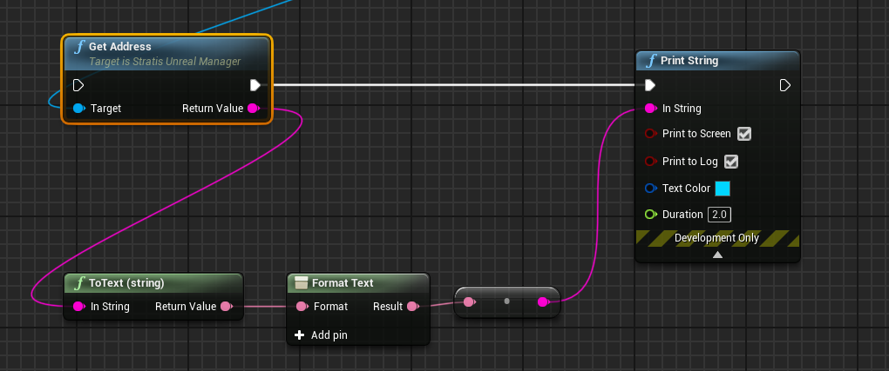
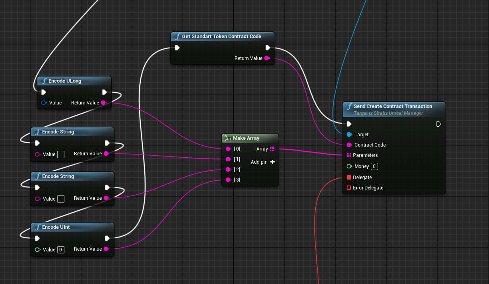
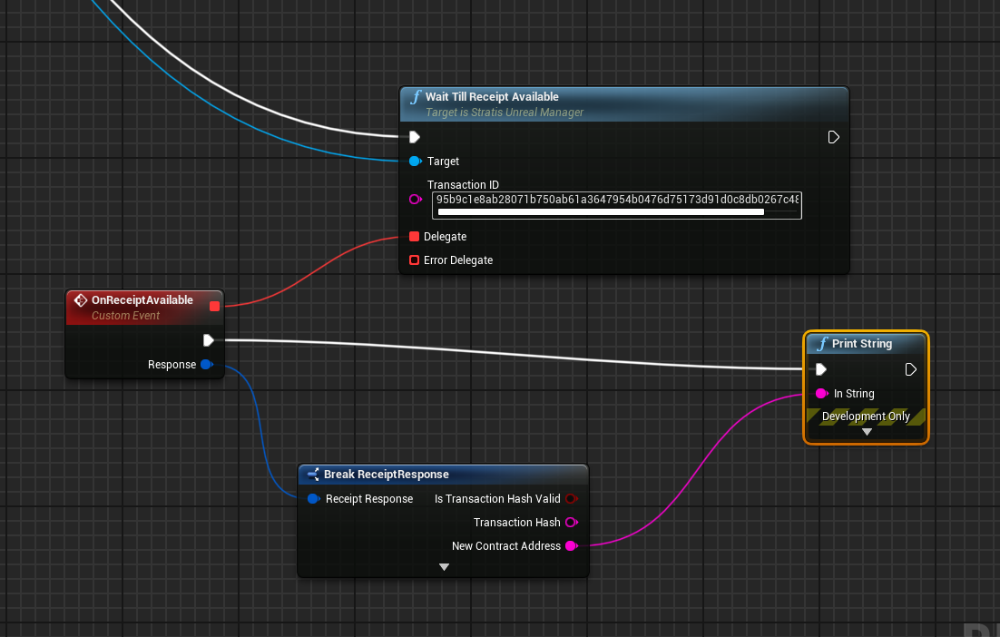
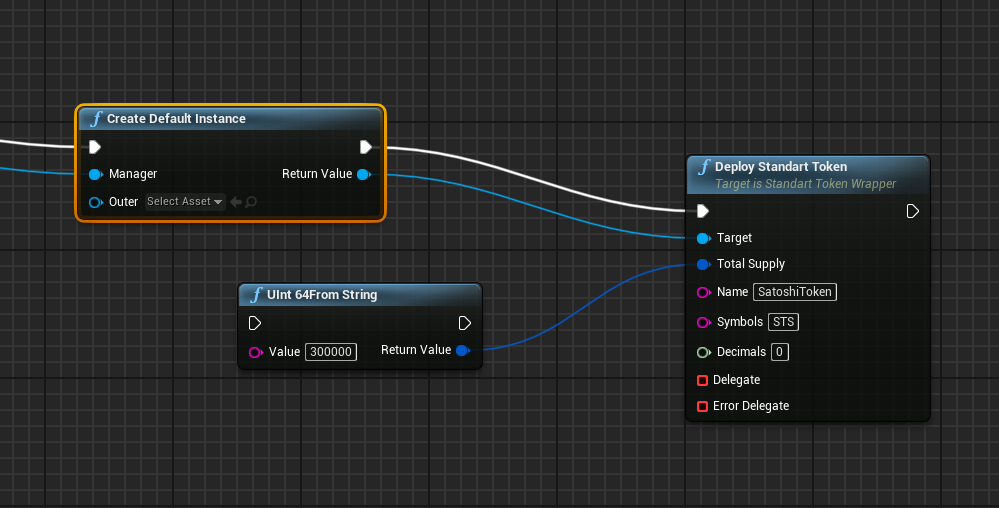
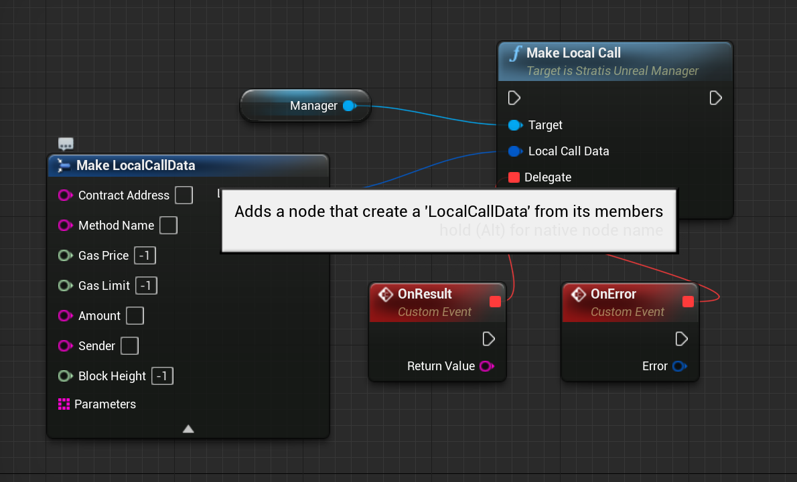
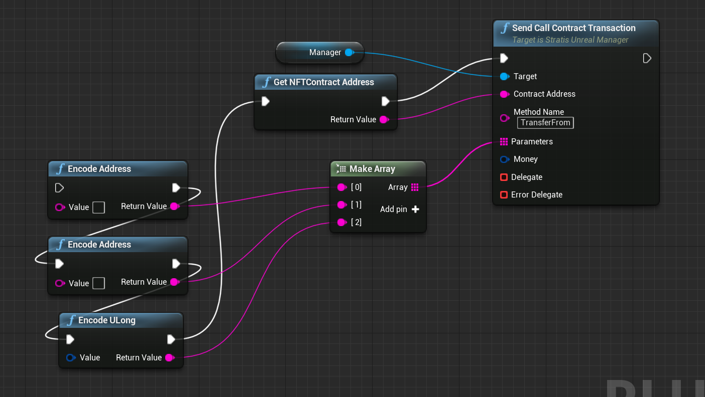
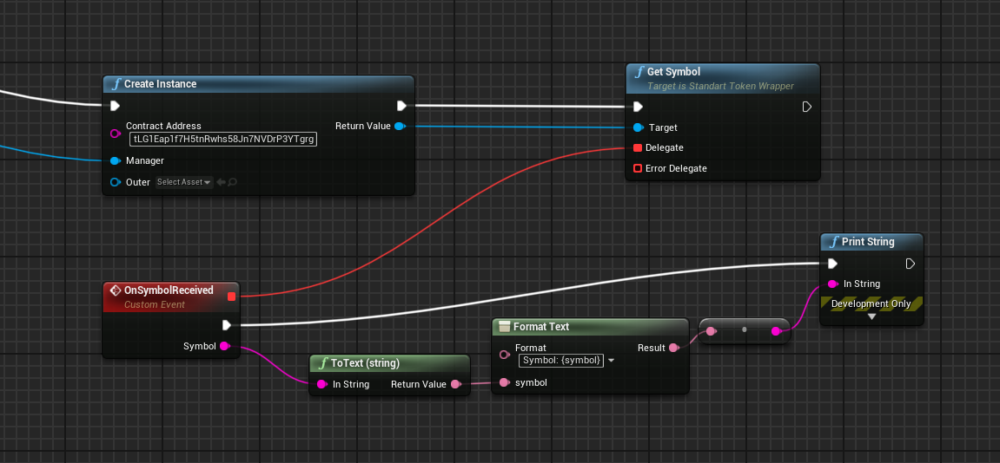
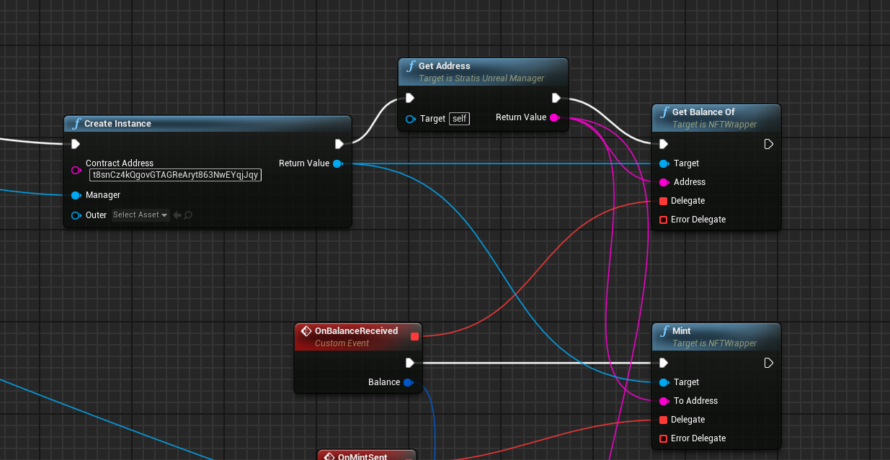

Stratis Smart Contracts with Unreal Engine
==========================================

Stratis Smart Contracts are enabled on Cirrus Main and Cirrus Test
networks. Only whitelisted smart contracts can be deployed. A list of
whitelisted smart contracts can be found here:
https://github.com/stratisproject/CirrusSmartContracts

You can also check if Smart Contract is whitelisted using
``/api/Voting/whitelistedhashes``. 

For example if you run node on CirrusTest; this link will provide you with list of hashes of whitelisted
contracts: http://localhost:38223/api/Voting/whitelistedhashes`

What is required to work with Stratis Smart Contracts
~~~~~~~~~~~~~~~~~~~~~~~~~~~~~~~~~~~~~~~~~~~~~~~~~~~~~

The `Stratis Unreal Engine Integration <https://academy.stratisplatform.com/Developer%20Resources/UnrealEngine/Integration/UnrealIntegration.html>`_ guide can be followed to setup your local environment for development.

Deploying Smart Contracts
~~~~~~~~~~~~~~~~~~~~~~~~~

When you deploy smart contracts you are creating a transaction which
requires a fee. So before you proceed make sure you have some STRAX or
TSTRAX (STRAX on testnet) deposited to your address.

This can be obtained from members of the community in the `Stratis Discord Server <https://discord.gg/P5ZsX37M4X>`_

The following code generates your address and then displays it in the debug
console.

.. raw:: html

   

   
<a>C++ version</a>

.. code-block:: cpp

    stratisManager =
         CreateDefaultSubobject<UStratisUnrealManager>(TEXT("StratisManager"));

     stratisManager->setBaseUrl(TEXT("http://148.251.15.126:44336"));
     stratisManager->setPredefinedNetwork(ENetwork::CIRRUS_TEST);
     stratisManager->setMnemonic(TEXT("legal door leopard "
                                      "fire attract stove "
                                      "similar response photo "
                                      "prize seminar frown"));

    UE_LOG(LogTemp, Display, TEXT("Address: %s"), *(stratisManager->getAddress()));

.. raw:: html

   

.. raw:: html

   

   
<a>Blueprint version</a>

.. image:: images/initialize-manager.png
   :target: images/initialize-manager.png
   :alt: Object construction

|

|

.. raw:: html

   

To deploy a smart contract you need to use ``StratisUnrealManager::sendCreateContractTransaction`` which returns the txId after execution. That txId can be used to get a receipt once the transaction has been executed. 

For example here is how to deploy StandardToken contract: 

.. raw:: html

   

   
<a>C++ version</a>

.. code-block:: cpp

    TArray<FString> parameters{
        USmartContractsParametersEncoder::encodeULong(totalSupply),
        USmartContractsParametersEncoder::encodeString(name),
        USmartContractsParametersEncoder::encodeString(symbol),
        USmartContractsParametersEncoder::encodeUInt(decimals)};

    this->stratisManager->sendCreateContractTransaction(
        UWhitelistedSmartContracts::GetStandardTokenContractCode(),
        parameters, 
        0,
         { 
            if (result::isSuccessful(result))
                UE_LOG(LogTemp, Display, TEXT("Contract deployment tx sent. Tx ID: %s"), *(result::getValue(result)));
        });

.. raw:: html

   

.. raw:: html

   

   
<a>Blueprint version</a>

|

`Full version <https://blueprintue.com/blueprint/drnhczve/>`_

.. raw:: html

   

And once transaction is confirmed you can use the below to query the receipt.

.. raw:: html

   

   
<a>C++ version</a>

.. code-block:: cpp
    
    manager->waitTillReceiptAvailable(
        /* tx id */ TEXT("95b9c1e8ab28071b750ab61a3647954b0476d75173d91d0c8db0267c4894d1f6"),
        /* callback */ [this](const TResult<FReceiptResponse>& result) {
            if (result::isSuccessful(result)) {
                FString contractAddress(result::getValue(result).newContractAddress);
            }
        }
    );

.. raw:: html

   

.. raw:: html

   

   
<a>Blueprint version</a>

.. raw:: html

   

::

    ReceiptResponse receipt = await
    client.ReceiptAsync("95b9c1e8ab28071b750ab61a3647954b0476d75173d91d0c8db0267c4894d1f6").ConfigureAwait(false);

    string contractAddr = receipt.NewContractAddress;

Also there are wrappers for smart contracts that perform constructor parameter encoding for you. You can check `StandartTokenWrapper` and `NFTWrapper` for examples.  Here is StandardToken deployment example using a wrapper: 

.. raw:: html

   

   
<a>C++ version</a>

.. code-block:: cpp

    UStandartTokenWrapper* standartTokenWrapper = ...;
    standartTokenWrapper->deployStandartToken(totalSupply, name, symbols, decimals,  {
        // use tx id
    });

.. raw:: html

   

.. raw:: html

   

   
<a>Blueprint version</a>

.. raw:: html

   

Using Smart Contracts
~~~~~~~~~~~~~~~~~~~~~

There are two ways to interact with a Smart Contract: a call and a local call. Calls should be used when you want to change a smart contract's state. Local calls are used to get data from a smart contract and using them doesn't result in a creation of an on-chain transaction, nor any associated cost. 

Here is an example of making a local call: 

.. raw:: html

   

   
<a>C++ version</a>

.. code-block:: cpp

   FLocalCallData localCallData;
   localCallData.gasPrice = 10000;
   localCallData.gasLimit = 250000;
   localCallData.amount = 0;
   localCallData.contractAddress = this->contractAddress;
   localCallData.methodName = TEXT("Owner");
   localCallData.sender = stratisManager->getAddress();

   this->stratisManager->makeLocalCall(
       localCallData,
        { 
        if (result::isSuccessful(result))
                UE_LOG(LogTemp, Display, TEXT("Result: %s"), *(result::getValue(result)));
        });

.. raw:: html

   

.. raw:: html

   

   
<a>Blueprint version</a>

.. raw:: html

   

The below is an example of making an on-chain call: 

.. raw:: html

   

   
<a>C++ version</a>

.. code-block:: cpp

    this->stratisManager->sendCallContractTransaction(
        /* contractAddress */ this->contractAddress, 
        /* methodName */ TEXT("TransferFrom"),
        /* parameters */ {
            USmartContractsParametersEncoder::encodeAddress(fromAddress),
            USmartContractsParametersEncoder::encodeAddress(toAddress),
            USmartContractsParametersEncoder::encodeULong(tokenID)
        },
        /* money */ 0, 
        /* callback */ [callback](const TResult<FString>& result) { callback(result); });

.. raw:: html

   

.. raw:: html

   

   
<a>Blueprint version</a>

.. raw:: html

   

Using Smart Contracts via Wrappers
~~~~~~~~~~~~~~~~~~~~~~~~~~~~~~~~~~

NFT and StandartToken contracts have wrappers to make it easier to interact with them. A Wrapper is a class that constructs call parameters and makes a call, further simplifying the process. 

Here is an example for StandardToken Wrapper that displays information about target StandardToken: 

.. raw:: html

   

   
<a>C++ version</a>

.. code-block:: cpp

    FString standardTokenAddress(TEXT("tLG1Eap1f7H5tnRwhs58Jn7NVDrP3YTgrg"));
    UStandartTokenWrapper *wrapper(UStandartTokenWrapper::createInstance(standardTokenAddress, manager, this));

    wrapper->getSymbol(
         { 
            if (result::isSuccessful(result))
                UE_LOG(LogTemp, Display, TEXT("Symbol: %s"), *(result::getValue(result)));
        });

.. raw:: html

   

.. raw:: html

   

   
<a>Blueprint version</a>

.. raw:: html

   

Here is an example for a NFT Contract and minting a new NFT: 

.. raw:: html

   

   
<a>C++ version</a>

.. code-block:: cpp

    FString nftAddress(TEXT("t8snCz4kQgovGTAGReAryt863NwEYqjJqy"));
    UNFTWrapper *wrapper;

    void runNFTExample() {
        wrapper = UNFTWrapper::createInstance(nftAddress, manager, this);

        wrapper->getBalanceOf(
            manager->getAddress(),
            [this](const TResult<uint64>& result) { 
                if (result::isSuccessful(result)) {
                    uint64 balance(result::getValue(result));
                    this->runMint(balance);
                }
            });
    }

    void runMint(uint64 balanceBefore) {
        wrapper->mint(
            manager->getAddress(),
            [this](const TResult<FString>& result) { 
                if (result::isSuccessful(result)) {
                    manager->waitTillReceiptAvailable(
                        /* tx id */ result::getValue(result),
                        /* callback */ [this](const TResult<FReceiptResponse>& result) {
                            if (result::isSuccessful(result)) {
                                this->doAfterMint(balanceBefore);
                            }
                        }
                    );
                }
            });
    }

    void doAfterMint(uint64 balanceBefore) {
        wrapper->getBalanceOf(
            manager->getAddress(),
            [this](const TResult<uint64>& result) { 
                if (result::isSuccessful(result)) {
                    uint64 balance(result::getValue(result));
                    UE_LOG(LogTemp, Display, TEXT("Balance before: %llu, balance after: %llu"), balanceBefore, balance); 
                    ensure(balance == balanceBefore + 1);
                }
            });
    }

.. raw:: html

   

.. raw:: html

   

   
<a>Blueprint version</a>

|

`Full version <https://blueprintue.com/blueprint/0gdbqgff/>`_

.. raw:: html

   

